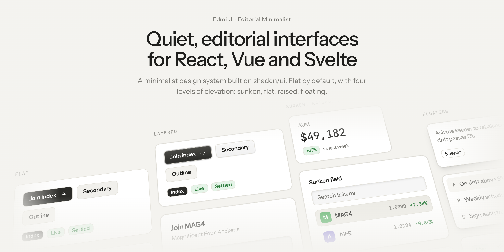
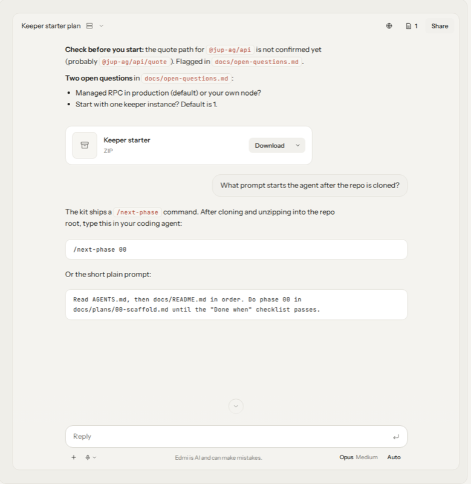
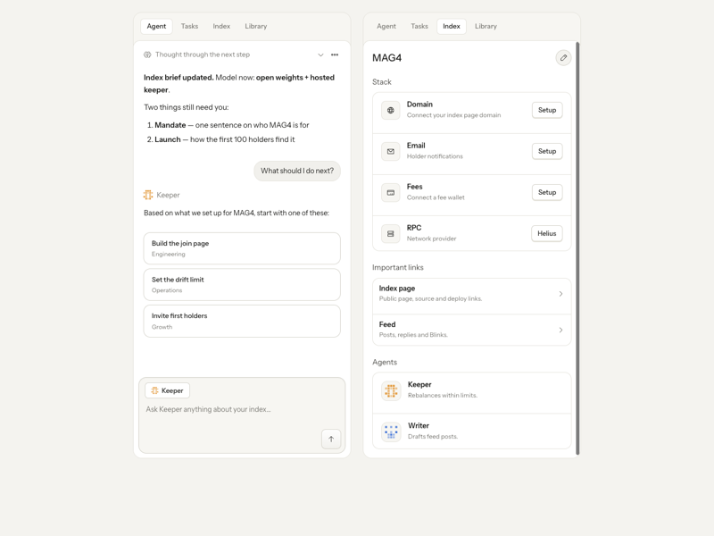

<p align="center">
  <picture>
    <source media="(prefers-color-scheme: dark)" srcset=".github/assets/hero-dark.png">
    
  </picture>
</p>

<p align="center">
  <a href="https://viandwi24.github.io/edmi-ui/"><strong>Documentation &amp; live demos →</strong></a>
  &nbsp;·&nbsp; <a href="https://viandwi24.github.io/edmi-ui/getting-started/">Getting started</a>
  &nbsp;·&nbsp; <a href="https://viandwi24.github.io/edmi-ui/components/">Components</a>
  &nbsp;·&nbsp; <a href="#ai-ready">AI components</a>
  &nbsp;·&nbsp; <a href="https://viandwi24.github.io/edmi-ui/examples/">Examples</a>
  &nbsp;·&nbsp; <a href="https://viandwi24.github.io/edmi-ui/themes/">Themes</a>
  &nbsp;·&nbsp; <a href="#agent-skills">Agent skills</a>
</p>

# Edmi UI

**Quiet, editorial interfaces for React, Vue and Svelte.** A minimalist design system built on shadcn/ui:
warm neutrals, mono numbers and one-step depth, inspired by Claude and Cofounder. **AI-ready out of the box**:
chat, agent, code, voice and workflow components ship next to the UI kit, in the same style, for all three frameworks.

## Features

- **shadcn-compatible.** Three registries, one per framework: React (shadcn/ui), Vue (shadcn-vue) and
  Svelte (shadcn-svelte). Same item names as shadcn, so `add … --overwrite` restyles the stock components.
- **AI-ready.** 56 AI components for chat, agents, code, runtime, voice and workflows, ready for the
  Vercel AI SDK. One command: `add @edmi-ui/ai-all`.
- **Flat by default, raised on demand.** Every component ships the plain look; `raised` ✦ adds a one-step 3D face.
- **Themeable.** Base colours, accents and radius as tokens; a [Themes customizer](https://viandwi24.github.io/edmi-ui/themes/) with Copy CSS and
  installable theme items (`theme-<base>-<accent>`).
- **Icons your way.** Phosphor by default, rewritten to your `iconLibrary` on install.
- **83 UI components and patterns + 56 AI components**, every one in React, Vue and Svelte, plus
  [22 live example pages](https://viandwi24.github.io/edmi-ui/examples/) (dashboards, chat, agent workspaces, marketing) in all three frameworks.

## AI-ready

<p align="center">
  <picture>
    <source media="(prefers-color-scheme: dark)" srcset="apps/docs/public/examples/chat-thread-dark.png">
    
  </picture>
  <picture>
    <source media="(prefers-color-scheme: dark)" srcset="apps/docs/public/examples/agent-workspace-dark.png">
    
  </picture>
</p>

The **Edmi AI pack** is everything you need to build an AI product UI, styled like the rest of Edmi (no avatars by
default, calm 15px response typography, solid chips, a terminal that stays dark). Every component ships for React,
Vue and Svelte, including ✦ patterns like artifact cards, session panels and agent avatars. Items are named
`ai-<name>` and install into `components/ai/`, next to (never into) your `components/ui/`.

| Category | Components |
| --- | --- |
| **Chat** | Conversation, Message (streaming markdown), Prompt Input, Suggestion, Attachments, Model Selector, Context, Shimmer |
| **Agent** | Reasoning, Chain of Thought, Tool, Confirmation, Sources, Inline Citation, Plan, Task, Queue, Checkpoint |
| **Code** | Agent, Artifact, Code Block, Commit, Environment Variables, File Tree, JSX Preview, Package Info |
| **Runtime** | Sandbox, Schema Display, Snippet, Stack Trace, Terminal, Test Results, Web Preview |
| **Voice** | Audio Player, Mic Selector, Persona, Speech Input, Transcription, Voice Selector |
| **Workflow** | Canvas, Node, Edge, Connection, Controls, Panel, Toolbar, Image, Open in Chat |
| **Patterns ✦** | Artifact Card, Artifact Stack, Artifact Viewer, Session Panel, Agent Avatar, Prompt Input Agent, Chat Composer, Chat Header |

Install the whole pack (React and Vue use the `@edmi-ui` namespace, see [Install](#install); Svelte uses URLs):

```bash
npx shadcn@latest add @edmi-ui/ai-all
npx shadcn-vue@latest add @edmi-ui/ai-all
npx shadcn-svelte@latest add https://viandwi24.github.io/edmi-ui/r/svelte/ai-all.json
```

Or pick single items: `npx shadcn@latest add @edmi-ui/ai-conversation @edmi-ui/ai-message @edmi-ui/ai-prompt-input`.

Browse every AI component with live demos under **AI** in the [components docs](https://viandwi24.github.io/edmi-ui/components/), and see them
composed in the AI examples: [chat thread](https://viandwi24.github.io/edmi-ui/examples/chat-thread/), [chat + artifact](https://viandwi24.github.io/edmi-ui/examples/chat-artifact/),
[agent workspace](https://viandwi24.github.io/edmi-ui/examples/agent-workspace/), [agent home](https://viandwi24.github.io/edmi-ui/examples/agent-home/),
[coding agent IDE](https://viandwi24.github.io/edmi-ui/examples/ide/), [agent workflow](https://viandwi24.github.io/edmi-ui/examples/workflow/) and [artifact library](https://viandwi24.github.io/edmi-ui/examples/library/).

## Links

- Docs and live demos: <https://viandwi24.github.io/edmi-ui/>
- Live examples (React, Vue and Svelte, every theme): <https://viandwi24.github.io/edmi-ui/examples/>
- Example apps (StackBlitz-ready): [`examples/react`](examples/react), [`examples/vue`](examples/vue), [`examples/svelte`](examples/svelte); Layerbeat (Slate · Ocean theme): [`examples/layerbeat-react`](examples/layerbeat-react), [`examples/layerbeat-vue`](examples/layerbeat-vue), [`examples/layerbeat-svelte`](examples/layerbeat-svelte)
- Changelog: <https://viandwi24.github.io/edmi-ui/changelog/> · Releasing: [RELEASING.md](RELEASING.md) · Contributing: [CONTRIBUTING.md](CONTRIBUTING.md)

**Flat by default, raised on demand.** Every component renders the plain shadcn look (solid fill, 1px border,
no gradient, no lip). Pass `raised` ✦ (`<Button raised>`, `<Card raised>`, `<TabsList raised>` and so on) for the
one-step 3D look: a face plus one hard lip under it. 42 UI components and patterns and 11 AI components accept
`raised`, each with a `<name>-raised` demo in all three frameworks (checked by the repo's `verify:matrix` script).
The docs landing page has a Flat / Raised toggle.

The long-term domain is `https://ui.edmi.dev` (the `EDMI_URL` default of the registry generator).

## Install

Registry base URL (latest): `https://viandwi24.github.io/edmi-ui/r/<framework>/{name}.json`

The commands below use `npx`. Use whichever package manager you like: swap `npx` for `pnpm dlx`, `yarn dlx`
or `bunx` (`bunx --bun` for shadcn-svelte). Edmi UI does not require Bun; only developing this monorepo does.

### Install everything

`theme` is the tokens, Tailwind map and fonts; `all` is every Edmi component; `patterns` is every ✦ pattern
block (headers, stat tiles, tickers, feeds, pricing, kanban and more); `ai-all` is the whole [AI pack](#ai-ready).
Add `all`, `patterns` and `ai-all` for everything.
`--overwrite` replaces the stock shadcn files with the Edmi versions.

```bash
# React, new project (the `edmi` base: theme, fonts, utils and every component)
npx shadcn@latest init https://viandwi24.github.io/edmi-ui/r/react/edmi.json
npx shadcn@latest add @edmi-ui/patterns @edmi-ui/ai-all

# React or Vue, existing project (register the @edmi-ui registry first, see below)
npx shadcn@latest add @edmi-ui/theme @edmi-ui/all @edmi-ui/patterns @edmi-ui/ai-all --overwrite
npx shadcn-vue@latest add @edmi-ui/theme @edmi-ui/all @edmi-ui/patterns @edmi-ui/ai-all --overwrite

# Svelte (URLs only)
npx shadcn-svelte@latest add https://viandwi24.github.io/edmi-ui/r/svelte/theme.json https://viandwi24.github.io/edmi-ui/r/svelte/all.json https://viandwi24.github.io/edmi-ui/r/svelte/patterns.json https://viandwi24.github.io/edmi-ui/r/svelte/ai-all.json --overwrite
```

### React (shadcn/ui)

```bash
# new project
npx shadcn@latest init https://viandwi24.github.io/edmi-ui/r/react/edmi.json

# existing shadcn project
npx shadcn@latest registry add "@edmi-ui=https://viandwi24.github.io/edmi-ui/r/react/{name}.json"
npx shadcn@latest add @edmi-ui/theme @edmi-ui/all --overwrite
```

### Vue (shadcn-vue)

Add the namespace to `components.json`:

```json
{ "registries": { "@edmi-ui": "https://viandwi24.github.io/edmi-ui/r/vue/{name}.json" } }
```

```bash
npx shadcn-vue@latest add @edmi-ui/theme @edmi-ui/all --overwrite
```

### Svelte (shadcn-svelte)

shadcn-svelte has no namespaced registries yet, so use URLs:

```bash
npx shadcn-svelte@latest add https://viandwi24.github.io/edmi-ui/r/svelte/theme.json
npx shadcn-svelte@latest add https://viandwi24.github.io/edmi-ui/r/svelte/all.json --overwrite
```

### Pinned versions via CDN

Each release also publishes the registries to npm (`@edmi-ui/registry-react`, `@edmi-ui/registry-vue`,
`@edmi-ui/registry-svelte`), served by jsDelivr. Pin a major:

```bash
npx shadcn@latest add https://cdn.jsdelivr.net/npm/@edmi-ui/registry-react@0/r/button.json
npx shadcn-vue@latest add https://cdn.jsdelivr.net/npm/@edmi-ui/registry-vue@0/r/button.json
npx shadcn-svelte@latest add https://cdn.jsdelivr.net/npm/@edmi-ui/registry-svelte@0/r/button.json
```

Design tokens alone: `npm install @edmi-ui/tokens` (or `pnpm add`, `yarn add`, `bun add`).

## Agent skills

Teach your coding agent (Claude Code, Cursor, Codex and many more) to install, theme and use Edmi UI with the
[`skills`](https://github.com/vercel-labs/skills) CLI:

```bash
npx skills add viandwi24/edmi-ui
```

(`pnpm dlx`, `yarn dlx` or `bunx` work the same.) The `edmi-ui` skill covers install flows for all three frameworks,
theming, when to use `raised`, the component catalog, the AI pack and upgrading. See
[Agent skills](https://viandwi24.github.io/edmi-ui/getting-started/skills/) in the docs.

## Updating

Components are copied into your project, so you upgrade by re-adding them: read the
[changelog](https://viandwi24.github.io/edmi-ui/changelog/), run `add @edmi-ui/<name> --overwrite` (or `theme`, `all`, `patterns`,
`ai-all`), review `git diff`, then typecheck. Pinned CDN URLs change version in the URL; `@edmi-ui/tokens` updates with your
package manager. Full guide: [Upgrading](https://viandwi24.github.io/edmi-ui/getting-started/upgrading/).

## Components

Every item of the design spec ships for all three frameworks. Legend: ✓ in the manifest, built registry JSON,
docs page and demo; – intentionally skipped. Generated by `bun run verify:matrix --markdown`.

<details>
<summary>UI component matrix (88 items)</summary>

| Group | Item | React | Vue | Svelte |
| --- | --- | :-: | :-: | :-: |
| Meta | `theme` | ✓ | ✓ | ✓ |
| Meta | `all` | ✓ | ✓ | ✓ |
| Meta | `patterns` | ✓ | ✓ | ✓ |
| Meta | `ai-all` | ✓ | ✓ | ✓ |
| Meta | `edmi` | ✓ | ✓ | ✓ |
| Actions | `button` | ✓ | ✓ | ✓ |
| Actions | `button-group` | ✓ | ✓ | ✓ |
| Actions | `toggle` | ✓ | ✓ | ✓ |
| Actions | `toggle-group` | ✓ | ✓ | ✓ |
| Actions | `badge` | ✓ | ✓ | ✓ |
| Actions | `kbd` | ✓ | ✓ | ✓ |
| Forms | `label` | ✓ | ✓ | ✓ |
| Forms | `input` | ✓ | ✓ | ✓ |
| Forms | `input-group` | ✓ | ✓ | ✓ |
| Forms | `input-otp` | ✓ | ✓ | ✓ |
| Forms | `textarea` | ✓ | ✓ | ✓ |
| Forms | `native-select` | ✓ | ✓ | ✓ |
| Forms | `select` | ✓ | ✓ | ✓ |
| Forms | `field` | ✓ | ✓ | ✓ |
| Forms | `checkbox` | ✓ | ✓ | ✓ |
| Forms | `radio-group` | ✓ | ✓ | ✓ |
| Forms | `switch` | ✓ | ✓ | ✓ |
| Forms | `slider` | ✓ | ✓ | ✓ |
| Forms | `combobox` | ✓ | ✓ | ✓ |
| Forms | `calendar` | ✓ | ✓ | ✓ |
| Forms | `date-picker` | ✓ | ✓ | ✓ |
| Display | `card` | ✓ | ✓ | ✓ |
| Display | `inset-panel` | ✓ | ✓ | ✓ |
| Display | `item` | ✓ | ✓ | ✓ |
| Display | `avatar` | ✓ | ✓ | ✓ |
| Display | `aspect-ratio` | ✓ | ✓ | ✓ |
| Display | `attachment` | ✓ | ✓ | ✓ |
| Display | `separator` | ✓ | ✓ | ✓ |
| Display | `skeleton` | ✓ | ✓ | ✓ |
| Display | `spinner` | ✓ | ✓ | ✓ |
| Display | `progress` | ✓ | ✓ | ✓ |
| Display | `empty` | ✓ | ✓ | ✓ |
| Overlays | `alert` | ✓ | ✓ | ✓ |
| Overlays | `alert-dialog` | ✓ | ✓ | ✓ |
| Overlays | `dialog` | ✓ | ✓ | ✓ |
| Overlays | `sheet` | ✓ | ✓ | ✓ |
| Overlays | `drawer` | ✓ | ✓ | ✓ |
| Overlays | `sonner` | ✓ | ✓ | ✓ |
| Overlays | `tooltip` | ✓ | ✓ | ✓ |
| Overlays | `hover-card` | ✓ | ✓ | ✓ |
| Overlays | `popover` | ✓ | ✓ | ✓ |
| Navigation | `dropdown-menu` | ✓ | ✓ | ✓ |
| Navigation | `context-menu` | ✓ | ✓ | ✓ |
| Navigation | `menubar` | ✓ | ✓ | ✓ |
| Navigation | `navigation-menu` | ✓ | ✓ | ✓ |
| Navigation | `command` | ✓ | ✓ | ✓ |
| Navigation | `breadcrumb` | ✓ | ✓ | ✓ |
| Navigation | `pagination` | ✓ | ✓ | ✓ |
| Navigation | `tabs` | ✓ | ✓ | ✓ |
| Navigation | `sidebar` | ✓ | ✓ | ✓ |
| Layout | `accordion` | ✓ | ✓ | ✓ |
| Layout | `collapsible` | ✓ | ✓ | ✓ |
| Layout | `resizable` | ✓ | ✓ | ✓ |
| Layout | `scroll-area` | ✓ | ✓ | ✓ |
| Layout | `carousel` | ✓ | ✓ | ✓ |
| Layout | `direction` | ✓ | ✓ | ✓ |
| Data | `table` | ✓ | ✓ | ✓ |
| Data | `data-table` | ✓ | ✓ | ✓ |
| Data | `chart` | ✓ | ✓ | ✓ |
| Conversation | `bubble` | ✓ | ✓ | ✓ |
| Conversation | `message` | ✓ | ✓ | ✓ |
| Conversation | `marker` | ✓ | ✓ | ✓ |
| Conversation | `message-scroller` | ✓ | ✓ | ✓ |
| Conversation | `questionnaire` | ✓ | ✓ | ✓ |
| Patterns ✦ | `site-header` | ✓ | ✓ | ✓ |
| Patterns ✦ | `app-header` | ✓ | ✓ | ✓ |
| Patterns ✦ | `stat-tile` | ✓ | ✓ | ✓ |
| Patterns ✦ | `ticker-strip` | ✓ | ✓ | ✓ |
| Patterns ✦ | `index-row` | ✓ | ✓ | ✓ |
| Patterns ✦ | `watchlist-item` | ✓ | ✓ | ✓ |
| Patterns ✦ | `allocation-bar` | ✓ | ✓ | ✓ |
| Patterns ✦ | `join-panel` | ✓ | ✓ | ✓ |
| Patterns ✦ | `leaderboard-podium` | ✓ | ✓ | ✓ |
| Patterns ✦ | `feed-post` | ✓ | ✓ | ✓ |
| Patterns ✦ | `agent-card` | ✓ | ✓ | ✓ |
| Patterns ✦ | `feature-row` | ✓ | ✓ | ✓ |
| Patterns ✦ | `step-card` | ✓ | ✓ | ✓ |
| Patterns ✦ | `pricing-plan` | ✓ | ✓ | ✓ |
| Patterns ✦ | `task-list` | ✓ | ✓ | ✓ |
| Patterns ✦ | `kanban-column` | ✓ | ✓ | ✓ |
| Patterns ✦ | `layout-picker` | ✓ | ✓ | ✓ |
| Patterns ✦ | `code-block` | ✓ | ✓ | ✓ |
| Patterns ✦ | `footer` | ✓ | ✓ | ✓ |

</details>

<details>
<summary>AI component matrix (56 items)</summary>

| Group | Item | React | Vue | Svelte |
| --- | --- | :-: | :-: | :-: |
| AI · Chat | `ai-conversation` | ✓ | ✓ | ✓ |
| AI · Chat | `ai-message` | ✓ | ✓ | ✓ |
| AI · Chat | `ai-prompt-input` | ✓ | ✓ | ✓ |
| AI · Chat | `ai-suggestion` | ✓ | ✓ | ✓ |
| AI · Chat | `ai-attachments` | ✓ | ✓ | ✓ |
| AI · Chat | `ai-model-selector` | ✓ | ✓ | ✓ |
| AI · Chat | `ai-context` | ✓ | ✓ | ✓ |
| AI · Chat | `ai-shimmer` | ✓ | ✓ | ✓ |
| AI · Agent | `ai-reasoning` | ✓ | ✓ | ✓ |
| AI · Agent | `ai-chain-of-thought` | ✓ | ✓ | ✓ |
| AI · Agent | `ai-tool` | ✓ | ✓ | ✓ |
| AI · Agent | `ai-confirmation` | ✓ | ✓ | ✓ |
| AI · Agent | `ai-sources` | ✓ | ✓ | ✓ |
| AI · Agent | `ai-inline-citation` | ✓ | ✓ | ✓ |
| AI · Agent | `ai-plan` | ✓ | ✓ | ✓ |
| AI · Agent | `ai-task` | ✓ | ✓ | ✓ |
| AI · Agent | `ai-queue` | ✓ | ✓ | ✓ |
| AI · Agent | `ai-checkpoint` | ✓ | ✓ | ✓ |
| AI · Code | `ai-agent` | ✓ | ✓ | ✓ |
| AI · Code | `ai-artifact` | ✓ | ✓ | ✓ |
| AI · Code | `ai-code-block` | ✓ | ✓ | ✓ |
| AI · Code | `ai-commit` | ✓ | ✓ | ✓ |
| AI · Code | `ai-environment-variables` | ✓ | ✓ | ✓ |
| AI · Code | `ai-file-tree` | ✓ | ✓ | ✓ |
| AI · Code | `ai-jsx-preview` | ✓ | ✓ | ✓ |
| AI · Code | `ai-package-info` | ✓ | ✓ | ✓ |
| AI · Runtime | `ai-sandbox` | ✓ | ✓ | ✓ |
| AI · Runtime | `ai-schema-display` | ✓ | ✓ | ✓ |
| AI · Runtime | `ai-snippet` | ✓ | ✓ | ✓ |
| AI · Runtime | `ai-stack-trace` | ✓ | ✓ | ✓ |
| AI · Runtime | `ai-terminal` | ✓ | ✓ | ✓ |
| AI · Runtime | `ai-test-results` | ✓ | ✓ | ✓ |
| AI · Runtime | `ai-web-preview` | ✓ | ✓ | ✓ |
| AI · Voice | `ai-audio-player` | ✓ | ✓ | ✓ |
| AI · Voice | `ai-mic-selector` | ✓ | ✓ | ✓ |
| AI · Voice | `ai-persona` | ✓ | ✓ | ✓ |
| AI · Voice | `ai-speech-input` | ✓ | ✓ | ✓ |
| AI · Voice | `ai-transcription` | ✓ | ✓ | ✓ |
| AI · Voice | `ai-voice-selector` | ✓ | ✓ | ✓ |
| AI · Workflow | `ai-canvas` | ✓ | ✓ | ✓ |
| AI · Workflow | `ai-node` | ✓ | ✓ | ✓ |
| AI · Workflow | `ai-edge` | ✓ | ✓ | ✓ |
| AI · Workflow | `ai-connection` | ✓ | ✓ | ✓ |
| AI · Workflow | `ai-controls` | ✓ | ✓ | ✓ |
| AI · Workflow | `ai-panel` | ✓ | ✓ | ✓ |
| AI · Workflow | `ai-toolbar` | ✓ | ✓ | ✓ |
| AI · Workflow | `ai-image` | ✓ | ✓ | ✓ |
| AI · Workflow | `ai-open-in-chat` | ✓ | ✓ | ✓ |
| AI · Patterns ✦ | `ai-artifact-card` | ✓ | ✓ | ✓ |
| AI · Patterns ✦ | `ai-artifact-stack` | ✓ | ✓ | ✓ |
| AI · Patterns ✦ | `ai-artifact-viewer` | ✓ | ✓ | ✓ |
| AI · Patterns ✦ | `ai-session-panel` | ✓ | ✓ | ✓ |
| AI · Patterns ✦ | `ai-agent-avatar` | ✓ | ✓ | ✓ |
| AI · Patterns ✦ | `ai-prompt-input-agent` | ✓ | ✓ | ✓ |
| AI · Patterns ✦ | `ai-chat-composer` | ✓ | ✓ | ✓ |
| AI · Patterns ✦ | `ai-chat-header` | ✓ | ✓ | ✓ |

</details>

Notes: `use-mobile` is not shipped for Vue (shadcn-vue has no such hook; the Vue sidebar uses
`@vueuse/core`). See [AGENTS.md](AGENTS.md) (decisions log).

## Development

Using Edmi UI works with any package manager. **Developing this monorepo** needs [Bun](https://bun.sh) (1.4 or
newer) as the only package manager and runtime; no Node install is required. Contributors: see
[CONTRIBUTING.md](CONTRIBUTING.md) and [AGENTS.md](AGENTS.md).

```bash
bun install
bun run gen:strict        # generate packages/<fw>/registry.json (fails on missing files/deps)
bun run build:registry    # build apps/docs/public/r/<fw>/*.json
bun run verify:matrix     # component x framework matrix + raised demos, exits 1 on gaps
bun run typecheck && bun run lint && bun test
bash scripts/smoke/all.sh # install the built registries into fresh React/Vue/Svelte projects
bun run dev               # docs site
```

- Design rules: <https://viandwi24.github.io/edmi-ui/getting-started/rules/>
- Repo knowledge, conventions, decisions and agent guidance: [AGENTS.md](AGENTS.md)

## License

[MIT](LICENSE) © 2026 viandwi24. Third-party notices: [NOTICE](NOTICE).
